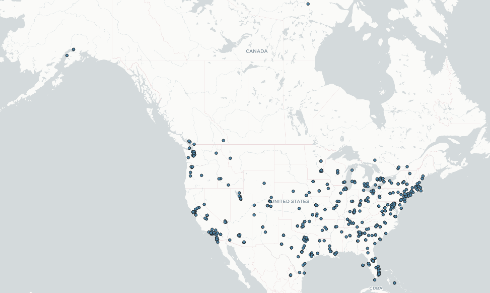

# GEOG 458 Lab 2: Geo-tagged tweet collection and visualization

The two places I'm comparing is between England and the United States. I'm comparing these two because I feel like there would be a difference in wording from American English and British English. 

## The Two Maps
US map

England map

One of the obvious difference is that one is in the United States and the other is in England which is in the UK area. They have different geospatial patterns likely because the main places that use twitter is quite different in each country. Also since England is quite smaller than the US, there are generally less data collected in general. We can see that the US is spreaded quite wide across the country except for the middle-top part. The England map generally has more tightly clustered patterns than the US. 

## The Two Word Clouds

US Word Cloud

England Word Cloud

The two word clouds have different context because the two places generally have different kinds of slangs use daily and I would expect the content of their twitter to be somewhat different too. We can see from the US one that the main words are job, bio, see, day, link, etc, while the main words from England are woof, real, kimberbabyluv, xx, etc. 